# Drivetrain Design

KinetiForge models the drivetrain as a 1D rotational system. The goal is not to
make every shaft and gear a separate rigid body, but to preserve the effects
that matter most for vehicle behavior:

- Torque transfer from the engine to the wheels.
- Wheel speed feedback from the road back into the drivetrain.
- Reflected inertia, so gear ratio and wheel load affect engine response.
- Torsional coupling, so gear changes can disturb engine RPM instead of looking
  perfectly interpolated.

This document describes the current drivetrain model and the engineering
tradeoffs behind the clutch spring model.

## Drivetrain Tree

One `VehicleDriveAssemblyComponent` represents one drivetrain tree:

```text
Engine
  -> Clutch
  -> Gearbox
  -> Transfer Case / Center Differential
  -> Axle Assemblies
  -> Differentials
  -> Wheels
```

A vehicle Actor can have more than one drive assembly. For example, a vehicle
can use separate front and rear drive assemblies, or use different assemblies
for unusual multi-power-unit layouts.

Each drive assembly normally owns or binds:

- One `VehicleEngineComponent`
- One `VehicleClutchComponent`
- One `VehicleGearboxComponent`
- One transfer case, implemented with `VehicleDifferentialComponent`
- Any number of `VehicleAxleAssemblyComponent` instances

These components can be generated from component classes, or selected from
existing Blueprint components. Components generated by an assembly are destroyed
with that assembly. Existing Blueprint components remain owned by the Actor.

## Data Flow

The drivetrain exchanges three main kinds of data:

- `Torque`: the twisting force passed through the drivetrain.
- `Angular velocity`: the rotational speed of each shaft or equivalent shaft.
- `Reflected inertia`: the downstream rotational inertia transformed through
  gear ratios.

The simplified information flow is:

```mermaid
flowchart LR
    Engine["Engine"]
    Clutch["Clutch / torsional coupling"]
    Gearbox["Gearbox"]
    Transfer["Transfer case / Central differential"]
    Axles["Axles / Differentials"]
    Wheels["Wheels"]

    Clutch -- "torque" --> Engine
    Clutch -- "torque" --> Gearbox
    Gearbox -- "torque" --> Transfer
    Transfer -- "torque" --> Axles
    Axles -- "torque" --> Wheels
    
    Gearbox -- "reflected inertia" --> Transfer
    Transfer -- "reflected inertia" --> Axles
    Axles -- "reflected inertia" --> Wheels

    Wheels -- "angular velocity" --> Axles
    Axles -- "angular velocity" --> Transfer
    Transfer -- "angular velocity" --> Gearbox
    Gearbox -- "angular velocity" --> Clutch
    Engine -- "angular velocity" --> Clutch

    Wheels -- "reflected inertia" --> Axles
    Axles -- "reflected inertia" --> Transfer
    Transfer -- "reflected inertia" --> Gearbox
    Gearbox -- "reflected inertia" --> Clutch
    Engine -- "inertia" --> Clutch

```



This is why wheel physics is not updated by `WheelCoordinatorComponent`.
Although aero components can be updated centrally, wheels participate in the
drivetrain solve. Their torque, angular velocity, and reflected inertia must be
exchanged in a strict order inside the drive assembly.

## Update Order

`VehicleDriveAssemblyComponent::UpdatePhysics` runs the drivetrain in substeps.
Each substep follows this order:

1. Update input smoothing and assists.
2. Update engine physics using the current clutch load torque.
3. Ask the gearbox for output torque and gearbox-side reflected inertia.
4. Update the transfer case, axles, differentials, and wheels.
5. Propagate wheel/output-shaft angular velocity and downstream inertia back to
   the gearbox input shaft.
6. Update the clutch model using engine speed, gearbox input speed, clutch
   input, and reflected inertia.

The clutch torque computed at the end of one substep becomes the load torque for
the engine in the next substep. This keeps the drivetrain stable while still
allowing gear-dependent RPM disturbance.

## Why Reflected Inertia Matters

The engine should not respond only to throttle and a fixed load. The downstream
drivetrain changes how heavy the engine "feels":

- A low gear reflects wheel inertia differently than a high gear.
- A locked or slipping clutch changes how strongly the engine is tied to the
  wheels.
- Wheel speed and tire behavior affect the gearbox input speed seen by the
  clutch.

Reflected inertia is one of the main reasons gear changes can feel different
instead of being a pure RPM interpolation.

## Clutch Component Roles

`VehicleClutchComponent` has two roles.

First, it is a clutch friction and lock model. It uses clutch input, clutch
capacity, engine torque, and speed difference to decide how much torque can be
transferred.

Second, in `SpringModel`, it acts as the main torsional coupling between the
engine and the downstream drivetrain. In this mode, the clutch is better
understood as an engine-to-drivetrain coupling element, not only as a literal
real-world clutch disc.

Depending on vehicle layout, this coupling can represent a lumped combination
of:

- Clutch compliance
- Gearbox input shaft compliance
- Propshaft or torque-tube compliance
- Other elastic elements between the engine and downstream driveline

For conventional front-engine/front-gearbox layouts, this is a reduced
approximation of several small compliances in the driveline. For front-engine
rear-transaxle layouts, where a long shaft connects the engine to the rear
gearbox, the coupling is close to a physically meaningful shaft location.

## Clutch Simulation Modes

### SpringModel

`SpringModel` uses a reduced two-inertia torsional spring-damper model. It
approximates both clutch compliance and equivalent shaft compliance at the
engine-to-drivetrain boundary.

This model is useful when you want:

- Engine RPM to react to gear changes.
- Visible drivetrain oscillation during shifts.
- A more mechanical connection between the engine and wheels.

It is not a full multi-inertia drivetrain shaft model. A real drivetrain with a
clutch spring and a separate propshaft spring would have more states and more
torsional modes. `SpringModel` intentionally collapses that behavior into one
reduced coupling for stability, simplicity, and tunability.

### DampingModel

`DampingModel` transfers torque with a critically damped style response and
smoothing. It is less dramatic and usually produces smoother RPM behavior.

This mode is useful for:

- Electric vehicles
- Arcade-like vehicles
- Setups where shift shock is not desired

### ConstraintModel

`ConstraintModel` computes a torque that attempts to remove clutch slip within
the current physics step, then clamps it by clutch capacity and lock amount.

This mode is more tolerant of larger physics timesteps than the spring model,
but it does not provide the same torsional oscillation behavior.

## Natural Frequency Instead Of Raw Stiffness

The spring model is configured with natural frequency rather than raw spring
stiffness.

Historically, this made the model easier to limit when the coupling used a more
explicit integration style. In the current model, it is still useful because the
effective stiffness can be derived from the current effective inertia. As gear
ratio and reflected inertia change, the coupling behavior changes with the
drivetrain state instead of using one fixed stiffness value for every condition.

This is a tuning-oriented interface. It should be understood as drivetrain
coupling frequency, not as a direct measurement of one real clutch spring.

## Current Simplification

The current `SpringModel` is a reduced model:

```text
Engine-side inertia
  <-> equivalent spring-damper coupling
Downstream reflected inertia
```

It does not explicitly simulate this full system:

```text
Engine inertia
  <-> clutch compliance
Gearbox input inertia
  <-> driveshaft compliance
Downstream reflected inertia
```

Because the reduced model has fewer states, it cannot reproduce every torsional
mode of a full three-inertia, two-spring driveline. Its purpose is to preserve
the low-frequency behavior that is most visible to the player:

- Engine RPM disturbance during shifts
- Gear-dependent drivetrain feel
- Stable torque transfer through the drivetrain tree

If you need a fully explicit multi-shaft torsional model, this component should
be treated as a starting point rather than a complete physical proof.

## Tuning Notes

- Use `SpringModel` when drivetrain shock and RPM oscillation are desirable.
- Use a smaller natural frequency if the drivetrain oscillates too aggressively
  or becomes unstable at your physics timestep.
- Increase damping to reduce oscillation.
- Increase clutch capacity if the clutch slips too easily under engine torque, or if more RPM oscillation are disirable.
- Use `DampingModel` or `ConstraintModel` for smoother or more timestep-tolerant
  vehicles.
- Async physics and a small fixed physics timestep are strongly recommended for
  spring-like drivetrain behavior.

## Related Components

- `VehicleDriveAssemblyComponent`: owns one drivetrain tree and controls update
  order.
- `VehicleClutchComponent`: computes clutch/coupling torque.
- `VehicleGearboxComponent`: maps input shaft and output shaft behavior through
  gear ratios.
- `VehicleDifferentialComponent`: acts as transfer case, axle differential, or
  center differential depending on where it is used.
- `VehicleAxleAssemblyComponent`: owns axle-side update logic and wheel groups.
- `VehicleWheelComponent`: computes wheel/tire interaction and contributes
  wheel speed and inertia back into the drivetrain.
